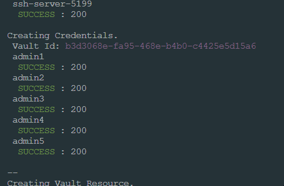

## Create SSH Resources
Leverages the PAM REST API to create x # of SSH Resources with x # of Credentials.
- Creates as many ssh vault resources as needed in PAM Credential Vault.
- Creates as many credentials in the newly created ssh resource.

